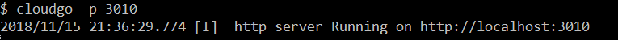
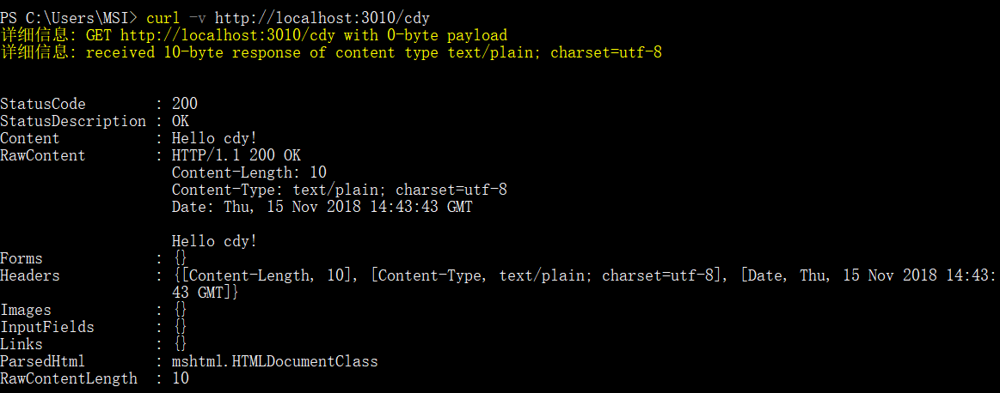
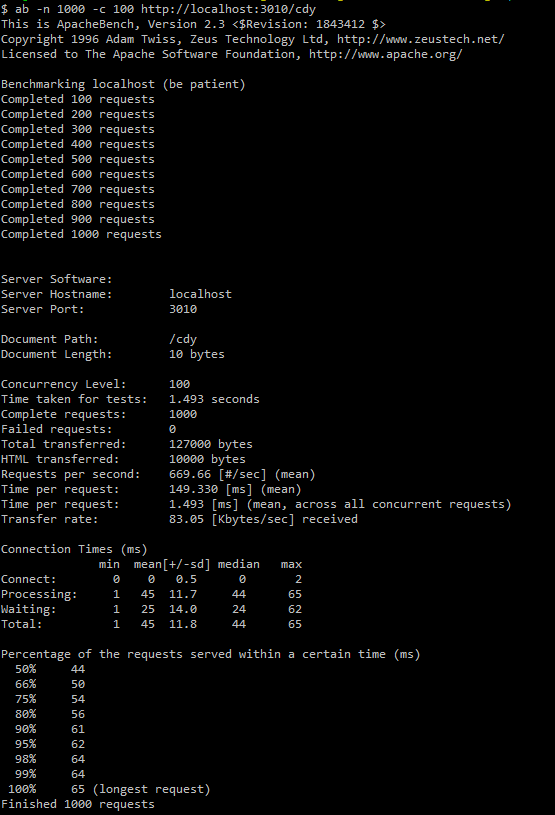

# cloudgo

使用beego框架的简单web应用程序，访问"/user"，服务器回应"Hello user!"。

### 运行程序

### 使用curl测试程序

可以看到服务器返回“Hello cdy!”

### 压力测试

#### 参数解释

##### 命令行

- -n 执行的请求数量
- -c 并发请求个数

##### 执行结果

- Concurrency Level 并发请求个数

- Time taken for tests 总请求时间

- Complete requests 总请求个数

- Failed requests 失败的请求个数

- Requests per second 平均每秒请求数（吞吐率）

- Time per request 平均每个请求消耗的时间 （用户平均等待时间）

- Time per request（across all concurrent requests）平均每个请求消耗的时间 / 并发数（服务器平均等待时间）

  它是吞吐率的倒数。

- Transfer rate 传输速率

- 最下面Percentage of the requests served within a certain time（ms）表示

  50%的请求在44ms内完成

  ...

  100%的请求在65ms内完成